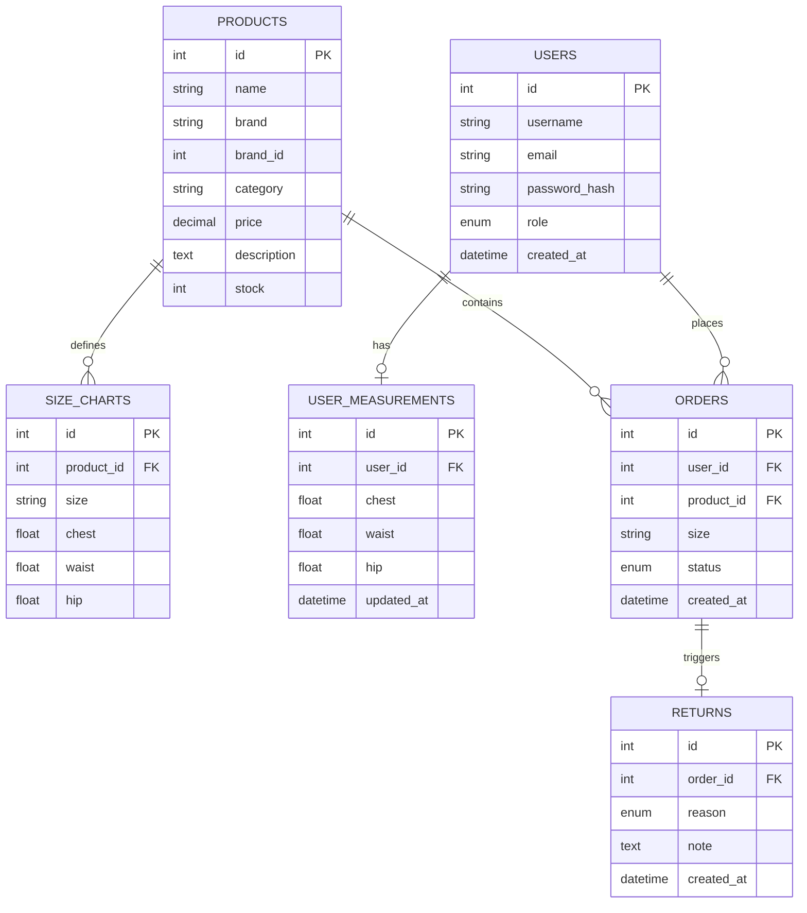

# FitRight — Smart Size Recommendation & Returns Analytics

> **FitRight** eliminates the guesswork in online fashion shopping by recommending the right size for each shopper and giving retailers actionable insight into why items are returned.

---

## Problem Statement

Fashion e-commerce has a return rate of 30–40%, with incorrect sizing being the single largest driver. Customers guess their size, get it wrong, and return the item — costing retailers in logistics, restocking, and lost revenue. FitRight solves this with two complementary systems:

1. **Size Recommendation Engine** — matches a shopper’s body measurements to a product’s size chart using nearest-neighbour (Euclidean distance) matching, then adjusts the recommendation based on historical return feedback (e.g., if 30%+ of returns say “too small”, the engine nudges the recommendation up one size).
2. **Returns Analytics Dashboard** — gives admins a real-time view of return rates by category, top return reasons, and products with the most size-related returns, all rendered as interactive Chart.js charts.

---

## ER Diagram



---

## Setup Steps

### Prerequisites
- Python 3.11+
- MySQL 8.0+ (or use Docker)
- Git

### Option A: Local Setup

```bash
# 1. Clone and enter project
git clone https://github.com/your-org/fitright.git
cd fitright

# 2. Create virtual environment
python -m venv venv
source venv/bin/activate        # Windows: venv\Scripts\activate

# 3. Install dependencies
pip install -r requirements.txt

# 4. Configure environment
cp .env.example .env
# Edit .env: set SECRET_KEY and DATABASE_URL for your MySQL instance

# 5. Create MySQL database
mysql -u root -p -e "CREATE DATABASE fitright;"

# 6. Run migrations
flask db upgrade

# 7. Seed sample data (30 products, 50 users, 200 orders)
python seeds/seed.py

# 8. Start development server
flask run
# Visit http://localhost:5000
# Admin: admin@fitright.com / Admin@1234
```

### Option B: Docker Compose

```bash
git clone https://github.com/your-org/fitright.git
cd fitright
docker-compose up --build
# Visit http://localhost:5000
```

### Running Tests

```bash
pytest          # runs all tests
pytest -v       # verbose output
pytest tests/test_recommendation.py   # recommendation engine only
```

---

## How the Recommendation Works

The size recommendation engine lives in [`app/services/recommendation.py`](app/services/recommendation.py) and operates in two steps:

### Step 1 — Nearest-Neighbour Size Match

For a given product, every row in its `size_charts` table is treated as a point in 3D measurement space (chest × waist × hip). The user’s saved measurements are compared to each size using **Euclidean distance**:

```
distance = √( (user_chest - chart_chest)²
            + (user_waist - chart_waist)²
            + (user_hip   - chart_hip  )² )
```

The size with the smallest distance wins. A **confidence label** is assigned based on that distance:

| Distance (cm) | Confidence | Badge Colour |
|---|---|---|
| < 5 | High | Green |
| 5 – 12 | Medium | Yellow |
| ≥ 12 | Low | Red |

### Step 2 — Return-Feedback Adjustment

The engine then queries `returns JOIN orders` for the product and checks whether size-related return reasons (`too_small` / `too_large`) exceed **30% of all returns** for that product:

- If **> 30% say `too_small`** → the product runs small → shift the recommendation **up** one size (e.g., M → L)
- If **> 30% say `too_large`** → the product runs large → shift the recommendation **down** one size (e.g., M → S)
- Otherwise, no adjustment is made

The product page shows the recommended size, confidence badge, and a note when an adjustment was applied.

---

## Definition of Done

A feature is considered **Done** when:

- [ ] Code is written, PEP8-compliant, and peer-reviewed
- [ ] All SQLAlchemy queries use the ORM (no raw SQL)
- [ ] Unit/integration tests written and passing (`pytest`)
- [ ] CSRF protection active on all POST forms
- [ ] Input validated server-side (WTForms validators)
- [ ] Passwords hashed via `werkzeug.security`
- [ ] Role-based access enforced (403 for unauthorised routes)
- [ ] Feature verified manually in browser (happy path + edge cases)
- [ ] CI pipeline (GitHub Actions) passes on PR
- [ ] README / docs updated if applicable

---

## Future Improvements

| Area | Idea |
|---|---|
| **ML Recommendation** | Replace Euclidean distance with a trained k-NN or gradient-boosted model incorporating purchase history, brand-specific fit, and fabric stretch factor |
| **Multi-image Products** | Add a `product_images` table; serve images from S3/CloudFront |
| **Real-time Inventory** | Integrate stock deduction on order placement; show low-stock warnings |
| **Review System** | Let customers leave star ratings and size-fit reviews, feeding directly into the recommendation adjustment |
| **Email Notifications** | Send order confirmation, shipping updates, and return status emails via SendGrid/SES |
| **Admin Product CRUD** | Allow admins to add/edit/delete products and size charts from the dashboard |
| **OAuth Login** | Add Google / GitHub social login via Flask-Dance |
| **A/B Testing** | Test different recommendation UIs (confidence badge placement, copy) to measure conversion lift |
| **API Layer** | Expose a REST/GraphQL API so mobile apps can consume the recommendation engine |
| **Caching** | Cache recommendation results with Redis (TTL 1 hour) to reduce DB load for popular products |
